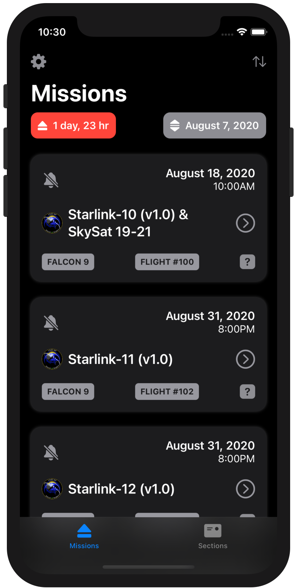
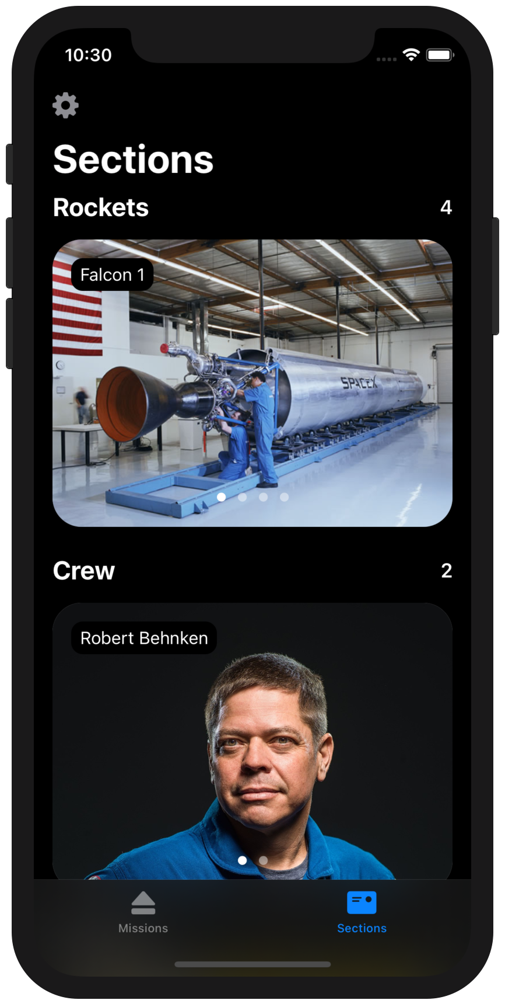

<!-- HEADER -->

<h1>Ray Wenderlich iOS Bootcamp [Summer 2020]</h1>

[][Twitter]

<!-- BODY -->
## 👨‍💻 About

### *Name | Discord name*
Bartolome Estelrich 
TC: Bartolome Estelrich \[*BEstelrich#0357*]

### *Location*
Toronto [Canada]

### *Programming experience*
Over two years ago I wrote, in Swift, my first line of code. Around 6 months later I released an app on AppStore [**Toronto2Do**](https://apps.apple.com/app/toronto2do/id1258574300). Since then I've been adding additional features to my app and used it as a motivation to keep learning Swift.

### *Goals*
Transition from Architecture and Design to iOS Development.

### *Hobbies*
Technology, Photography, Home automation and Futuristic movies. 

## 👨‍🎓 Curriculum
Details: [Ray Wenderlich Bootcamp website](https://www.raywenderlich.com/10408731-rw-bootcamp)

### *Capstone: Space Xploration*
For my Capstone project I focused on the **Space X company**. Space Xploration provides updated information about all the Space X missions and company sections, presenting a whole variety of details for space enthusiasts.

Despite the fact of being a one week project, it was a lot of fun to build my first fully functional app in SwiftUI. And after adding some more features to the Capstone, Space Xploration is now **available on the App Store! 🥳**

	

	
	

### *Course syllabus*

	
<b>Week 01. Controls, outlets and UIKit</b>

	

	📚 Video course: <a href="https://www.raywenderlich.com/5539282-programming-in-swift-fundamentals">Programming in Swift: Fundamentals</a> 
	📱 Assignment: <a href="./Week%2002/Readme.md">BullsEye, RGBullsEye and RevBullsEye</a>
	

	
<b>Week 02. Swift fundamentals</b>

	

	📚 Video course: <a href="https://www.raywenderlich.com/5539282-programming-in-swift-fundamentals">Programming in Swift: Fundamentals</a> 
	📱 Assignment: <a href="./Week%2002/Readme.md">BullsEye, RGBullsEye and RevBullsEye</a>
	

	
<b>Week 03. Swift functions and types</b>

	

	📚 Video course: <a href="https://www.raywenderlich.com/5429279-programming-in-swift-functions-and-types">Programming in Swift: Functions and Types</a> 
	📱 Assignment: <a href="./Week%2003/Readme.md">Crypty</a>
	

	
<b>Week 04. Layout, testing and debugging</b>

	

	📚 Video course: <a href="https://www.raywenderlich.com/4681-beginning-ios-debugging">Beginning iOS Debugging</a> 
	📚 Video course: <a href="https://www.raywenderlich.com/6849561-layout-in-ios">Layout in iOS</a> 
	📚 Article: <a href="https://www.raywenderlich.com/960290-ios-unit-testing-and-ui-testing-tutorial">iOS Unit Testing and UI Testing Tutorial</a> 
	📱 Assignment: <a href="./Week%2004/Readme.md">ComparisonShopper and CompatibilitySlider</a>

	
<b>Week 05. Table views</b>

	

	📚 Video course: <a href="https://www.raywenderlich.com/5995-beginning-table-views">Beginning Table Views</a> 
	📱 Assignment: <a href="./Week%2005/Readme.md">Birdie</a>
	

	
<b>Week 06. Collection views</b>

	

	📚 Video course: <a href="https://www.raywenderlich.com/5429927-beginning-collection-views">Beginning Collection Views</a> 
	📱 Assignment: <a href="./Week%2006/Readme.md">Pokedex</a>
	

	
<b>Week 07. SwiftUI</b>

	

	📚 Video course: <a href="https://www.raywenderlich.com/4919757-your-first-ios-and-swiftui-app">Your First iOS and SwiftUI App</a> 
	📚 Video course: <a href="https://www.raywenderlich.com/5662524-your-second-ios-and-swiftui-app">Your Second iOS and SwiftUI App</a> 
	📚 Video course: <a href="https://www.raywenderlich.com/4001741-swiftui">SwiftUI</a> 
	📚 Article: <a href="https://www.raywenderlich.com/393-rwdevcon-2017-inspiration-talk-finding-freedom-through-freelancing-by-lyndsey-scott">Finding Freedom Through Freelancing by Lyndsey Scott</a> 
	📱 Assignment: <a href="./Week%2007/Readme.md">BirdUI</a>
	

	

	

	
<b>Week 08. Saving data</b>

	

	📚 Video course: <a href="https://www.raywenderlich.com/5429634-saving-data-in-ios">Saving Data in iOS</a> 
	📚 Video course: <a href="https://www.raywenderlich.com/7104-beginning-core-data">Beginning Core Data</a> 
	📱 Assignment: <a href="./Week%2008/Readme.md">SandwichSaturation</a>
	

	
<b>Week 09. Networking and design patters</b>

	

	📚 Video course: <a href="https://www.raywenderlich.com/1941154-fundamental-ios-design-patterns#c-rate">Fundamental iOS Design Patterns</a> 
	📚 Video course: <a href="https://www.raywenderlich.com/10376245-networking-with-urlsession">Networking with URLSession</a> 
	📱 Assignment: <a href="./Week%2009/Readme.md">jQuiz</a>
	

	
<b>Week 10. Concurrency and memory management</b>

	

	📚 Video course: <a href="https://www.raywenderlich.com/9461083-ios-concurrency-with-gcd-and-operations">iOS Concurrency with GCD and Operations</a> 
	📚 Article: <a href="https://www.raywenderlich.com/966538-arc-and-memory-management-in-swift">ARC and Memory Management in Swift</a> 
	📱 Assignment: <a href="./Week%2010/Readme.md">Animations</a>
	

	
<b>Week 11. Animation, Xcode tips and tricks</b>

	

	📚 Video course: <a href="https://www.raywenderlich.com/10523008-beginning-ios-animations">Beginning iOS Animations</a> 
	📚 Video course: <a href="https://www.raywenderlich.com/3199-xcode-tips-and-tricks">Xcode Tips and Tricks</a> 
	📱 Assignment: <a href="./Week%2011/Readme.md">AnimationFactory</a>
	

	
<b>Week 12. Capstone project: Space Xploration</b>

	

	📱 Assignment: <a href="./Week%2012/Readme.md">Space Xploration</a>
	

	

	
	
<!-- FOOTER -->
<!-- Permanent links -->
[Twitter]: https://twitter.com/BEstelrich