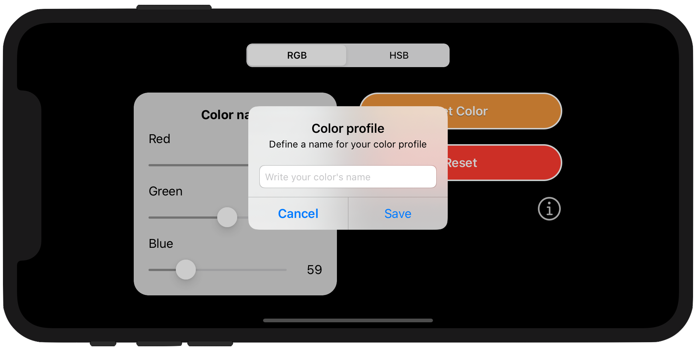

	
	<h1>Week 01. Controls, outlets and UIKit</h1>

  
  
  

## Frameworks
* UIKit
* WebKit

## Description
This is a simple app called **ColorPicker** that, by using three independent sliders based on the **RGB** [Red, Green, Blue] or **HSB** [Hue, Saturation, Brightness] color systems, allows the user to create and name a custom color. The entire application has been build using Storyboards and defining different behaviors according its screen orientation and device size using *Vary for traits*.

In addition of the previous functionality there is an `Information` button that presents a new view-controller modally and displays the RGB website page on Wikipedia.

In order to get a live preview of the changes made on the color sliders, the actual `Set Color` itself updates its background to the current sliders color.

## Screenshots
Those are the most relevant screenshots on the app.

	
	

	

	

