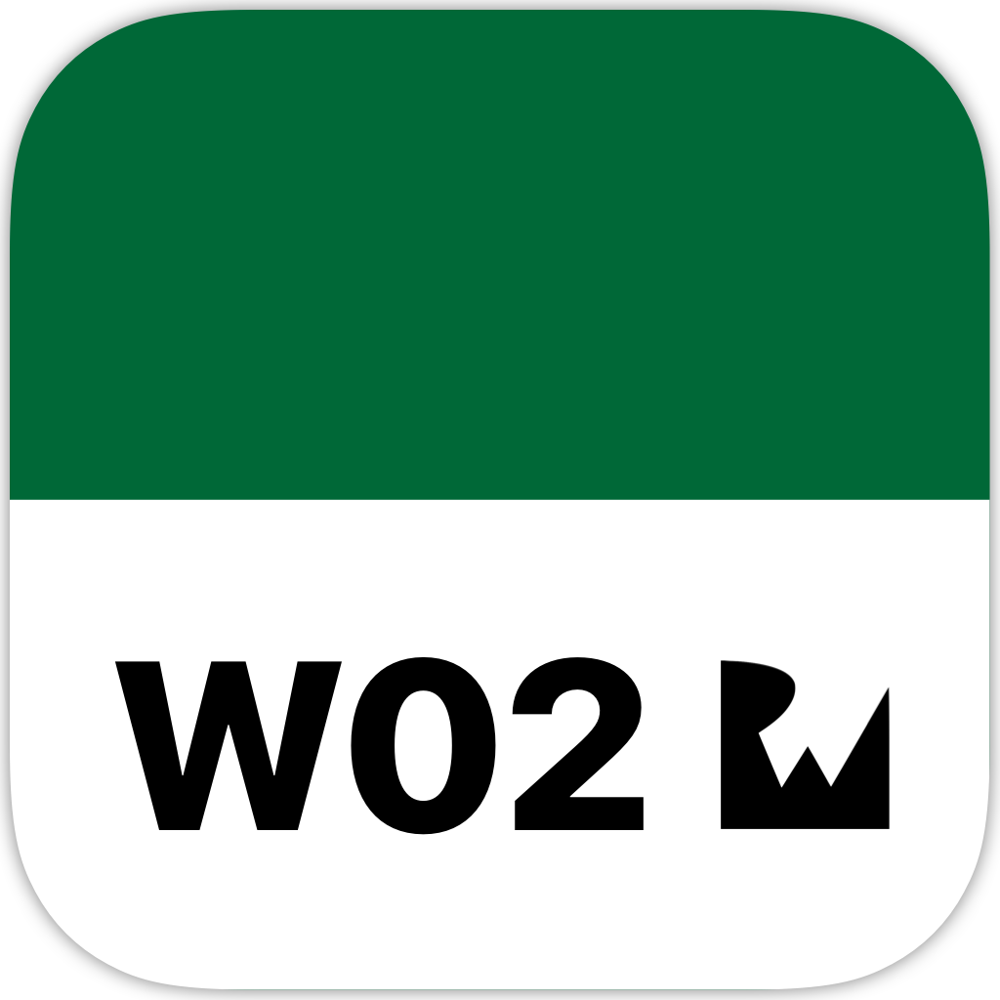

	
	<h1>Week 02. Swift fundamentals</h1>

  
  
  

## Frameworks
* UIKit

## Description
This exercise is made up of several short projects.

#### *1. BullsEye*
In order to avoid the default view-controller to become a Massive View Controllers the goal of this exercise is to **extract the game logic** out of it. To accomplish this task there is a decision to be made about if the model object would be a **Struct** or a **Class**.

#### *2. RGBullsEye*
Using the concepts learned on the previous exercise the logic of this project has to be created. The goal here is **matching the randomly chosen color by moving the sliders** corresponding to the RGB color system and updating the live result in another view. Finally an alert has to be presented to the user with each round's result.

#### *3. RevBullsEye*
RevBullsEye is about reversing the previous BullsEye game from moving the slider to match a displayed number to guessing the number of the slider current position. Although the UI can be slightly modified to accommodate the game new rules, **the game logic object cannot change**.

## Conclusion: Class vs Struct
On this exercise my decision was to use a **Class** to define the BullsEyeGame object.

However on this specific scenario, where there is only one instance of the object in a single view-controller, I don't believe there is much difference between a value type/reference type approach on the overall result. Because of those facts there **will never be more than one instance of the object**, so there are no additional copies anyway in case of a Struct is chosen.

Nonetheless, by using a Class there is **no need to set most of the object methods as mutable** in order to change its properties. Also when a project grows in functionality a Class has always the possibility of inheriting from another Class making it **more flexible**.
