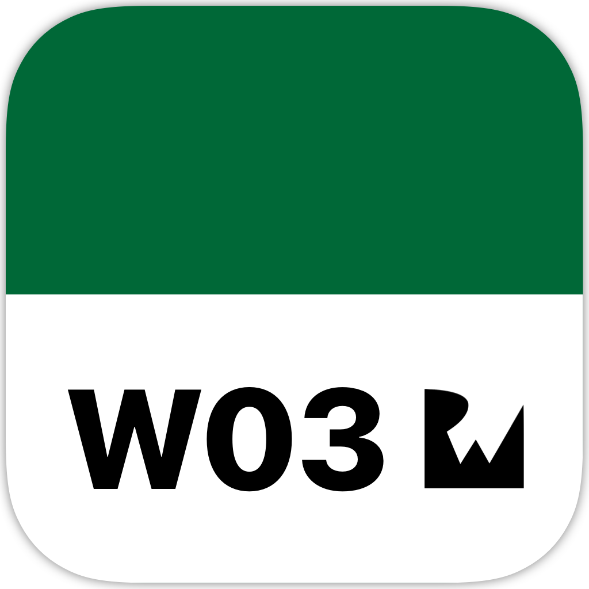
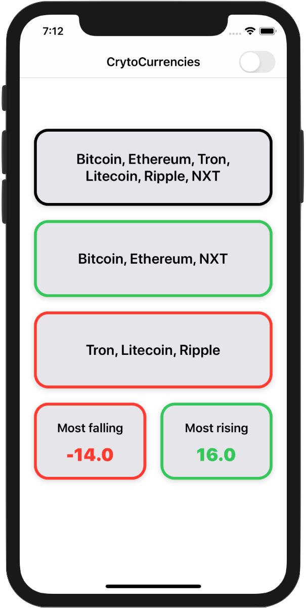
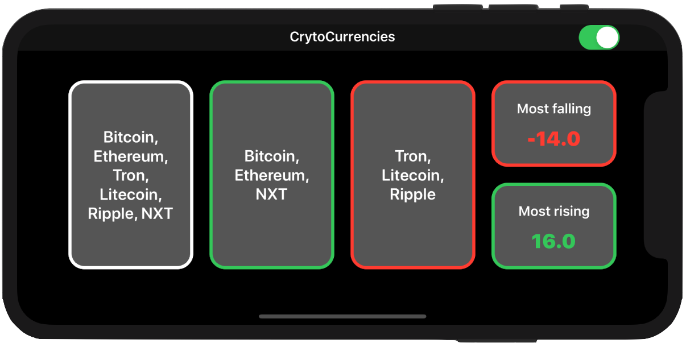

	
	<h1>Week 03. Swift functions and types</h1>

  
  
  

## Frameworks
* UIKit

## Description
This short project is about creating an app called Cryptly that **displays some cryptocurrencies** prices generated from an embedded JSON file.

Starting from a Singleton object that generates a simulated cryptocurrency data, the model object it's created to accommodate this data. To set the view up, a data parsing has been done on the model instance by using **Higher Order Functions** in order to filter the correspondent information on each view.

On the order hand, **theme support** is implemented by creating a protocol that defines the theme requirements. An object that conforms to this protocol is being passed to the `Theme Manager` Singleton triggering an observer from the view-controller that takes care of the theme application itself.

Finally, an additional protocol called `Roundable` is set to define any view with **rounded corners**. Also default rounded method is provided by **overloading a protocol required method**.

## Preview
Those are the most relevant screenshots on the app.

	
	

