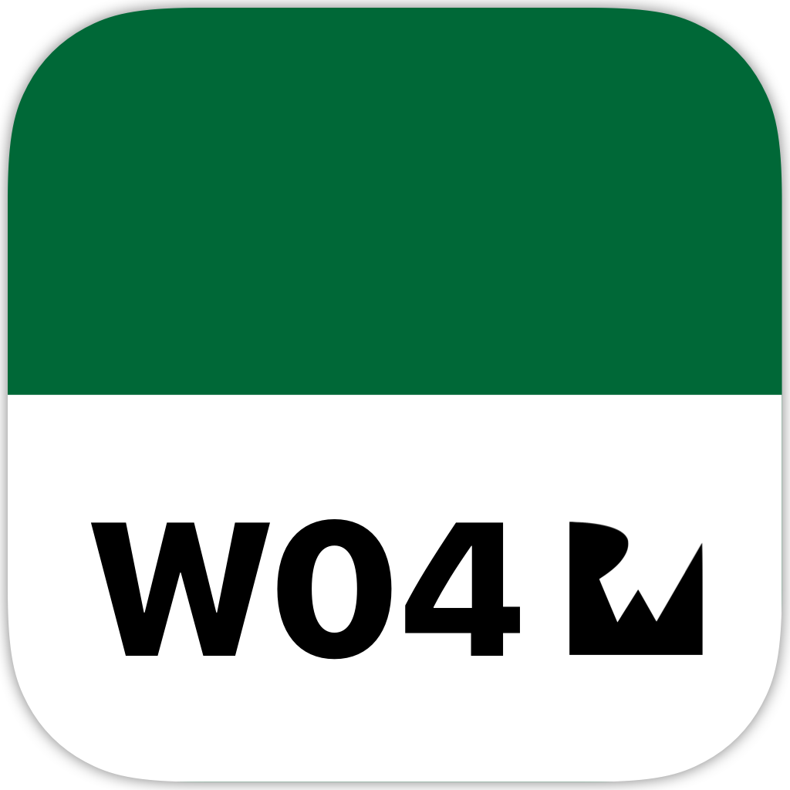
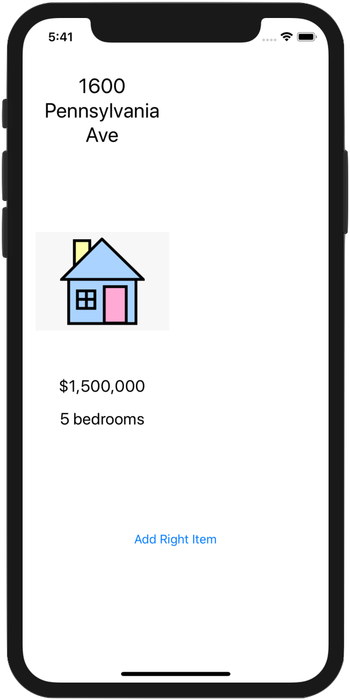
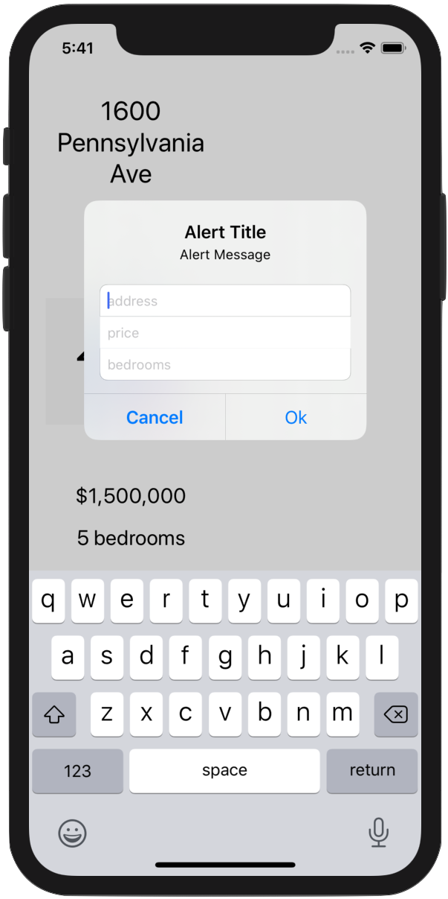
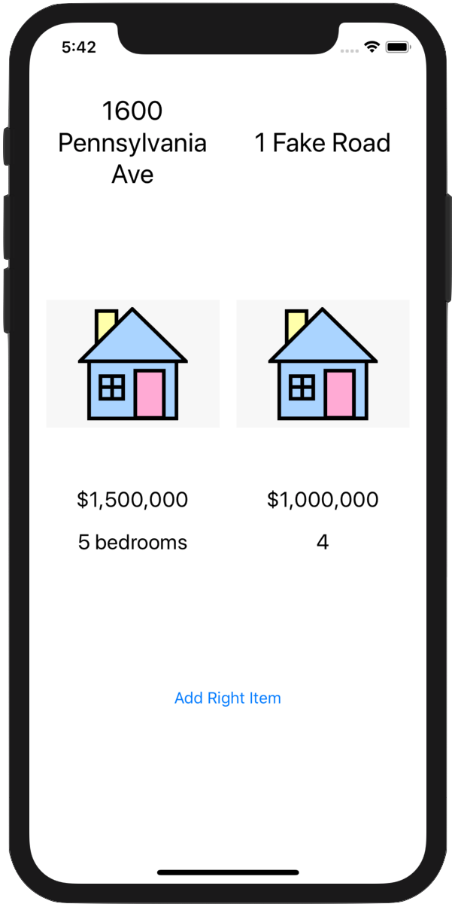
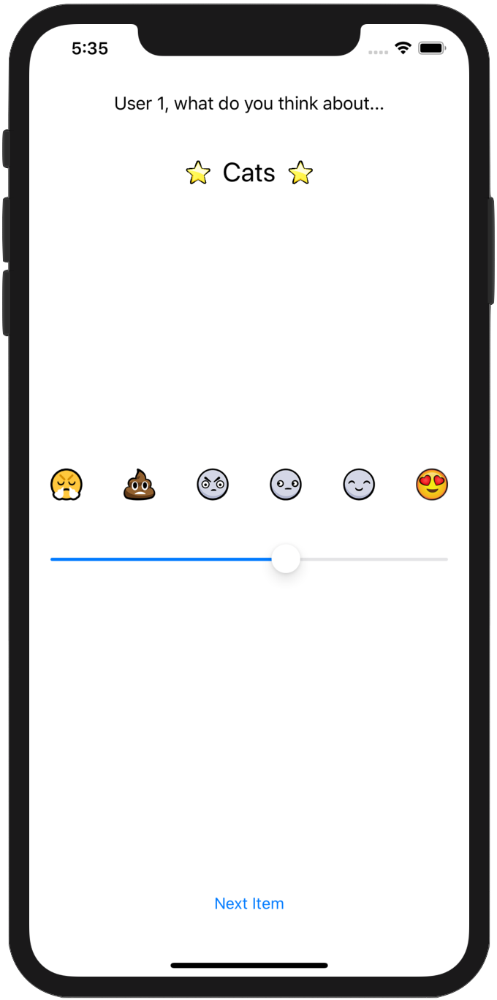
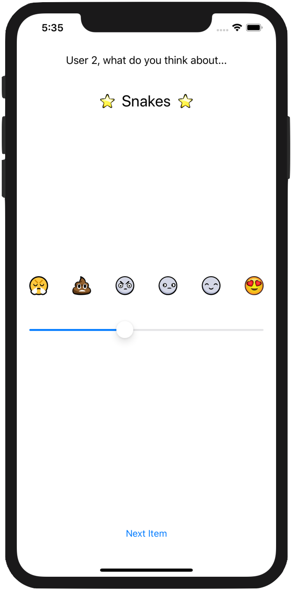

<!-- Header -->

<h1>Week 04. Layout, testing and debugging</h1>

<!-- Body -->
## Frameworks/External dependencies
- Foundation
- UIKit

## Description
This exercise has two separated parts related to this week's topic.

### *1. ComparisonShopper*
The starter project had some bugs that needed to be fixed. The purpose of this section was to work with **breaking points and LLBD [Low Level Debugger]** to fixed those bugs by check the value of some optionals in runtime.

### *2. CompatibilitySlider*
CompatibilitySlider gives you a compatibility percentage between two persons after each one evaluates different topics. In this case, the Person object was a class and the view-controller needed to **update the currentPerson instance according to the active user** in each specific moment, **saving their evaluations** and displaying an alert with the compatibility percentage at the end of the game. **Auto-layout** was used as well to take care of the proper views resizing for multiple devices.

## Preview
Those are the most relevant screenshots of the app.

### *1. ComparisonShopper*

	
	
	

### *2. CompatibilitySlider*

	
	
	

<!-- Footer -->