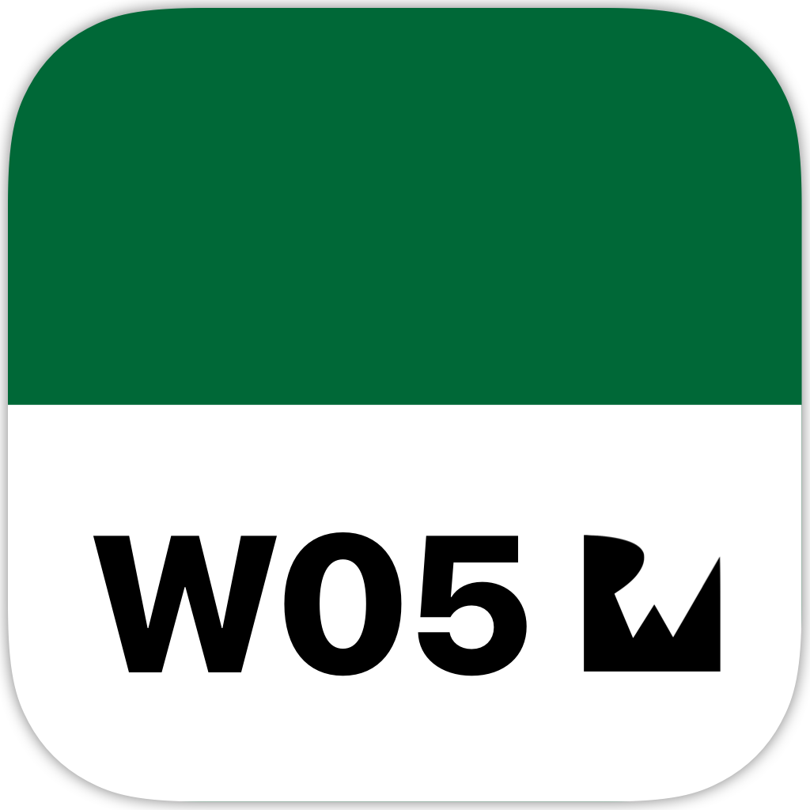
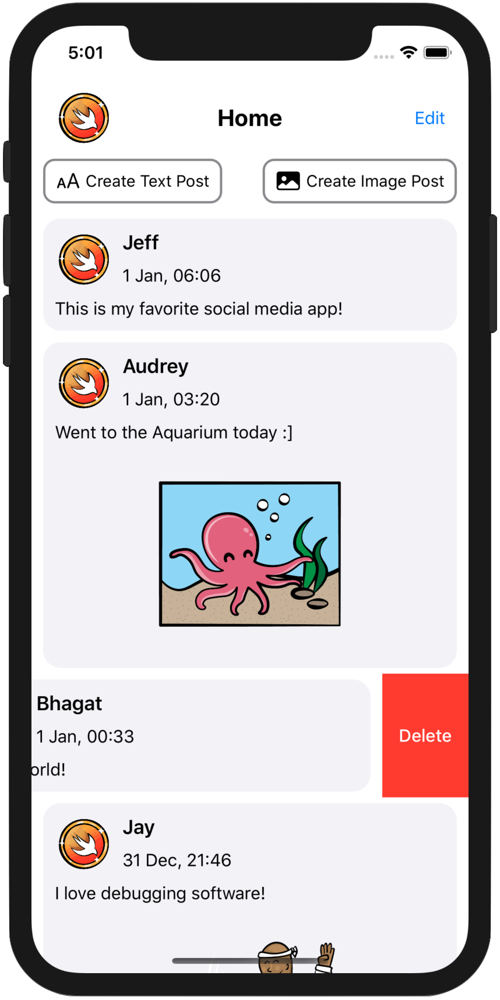
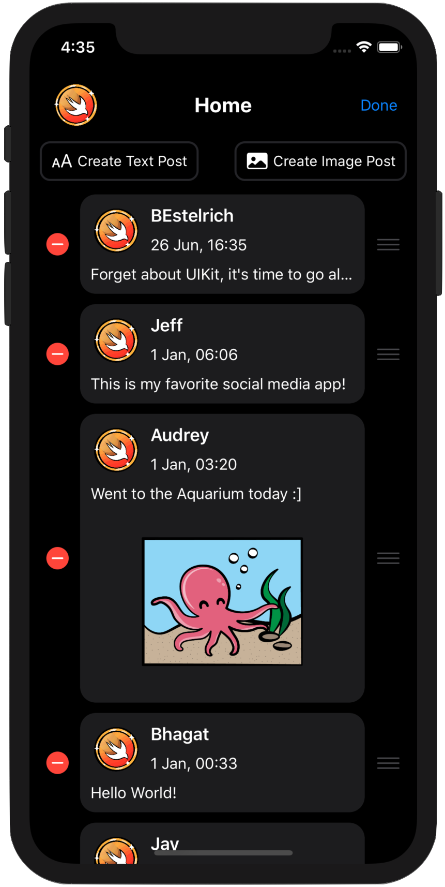
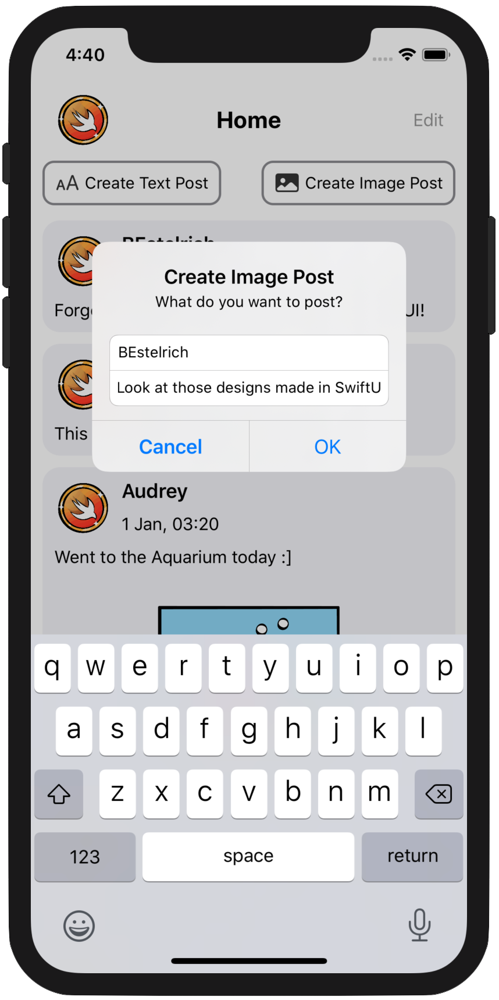
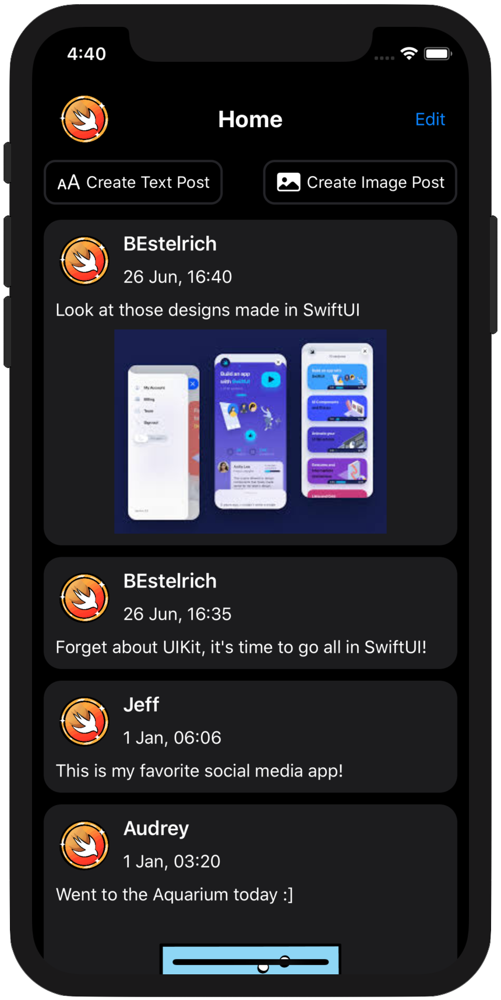

<!-- Header -->

<h1>Week 05. Table views</h1>

<!-- Body -->
## Frameworks/External dependencies
- Foundation
- UIKit

## Description
Birdie is an app that **fetches media posts** from a singleton object and displays them inside a table-view. Two different post types that can be created in the app: **text posts and image posts**. An alert with its respective TextFields is presented for the user to write the post's username and body. Creating a post with image is done by using the **iOS photo picker** to select the image the user wants to post, and lastly defining the additional details on its own alert.

Posts are sorted by date by default but they can be **reordered or deleted** as well when the Edit button is tapped. Finally, the app handles successfully the scenario where the user doesn't write any username or body in the post.

## Preview
Those are the most relevant screenshots on the app.

	
	
	
	

<!-- Footer -->