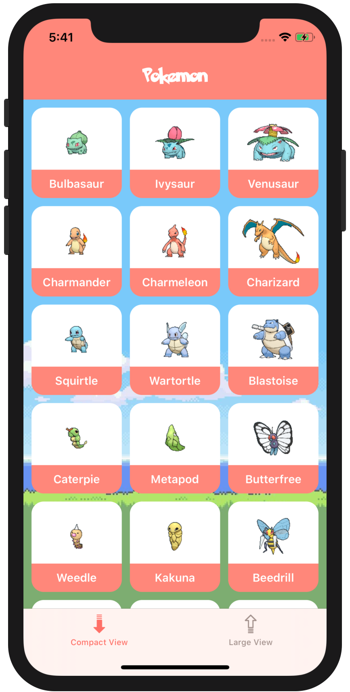
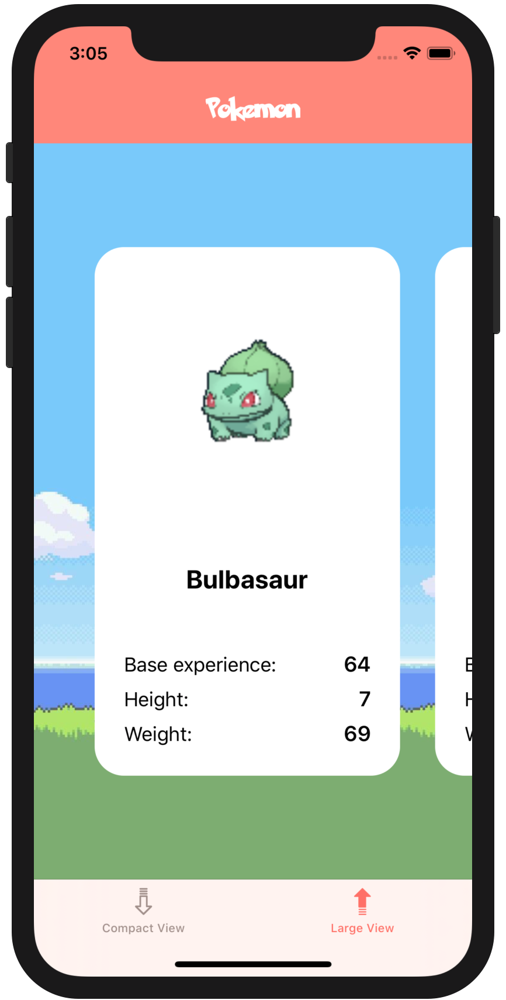

<!-- Header -->

<h1>Week 06. Collection views</h1>

<!-- Body -->
## Frameworks/External dependencies
- Foundation
- UIKit

## Description
Lessons on week six were around collection-views and the different ways they can be implemented: **Flow Layout and Compositional Layout**. The purpose of this exercise was to use a TabBar to set two different collection-views presenting similar data. There was a requirement where our **collection-view will always display three columns of cells** no matter the device size the app is running into.

This proposal has been completed using the collection-view **Compositional Layout** for both cases and using a singleton to generate Pokemon characters from a `.csv` embedded file. A `DataManager` class has been used to **centralize the setup of collection-view data sources** and similarly a `LayoutCoordinator` object **configures our cells** for each scenario.

## Preview
Those are the most relevant screenshots of the app.

	
	

<!-- Footer -->