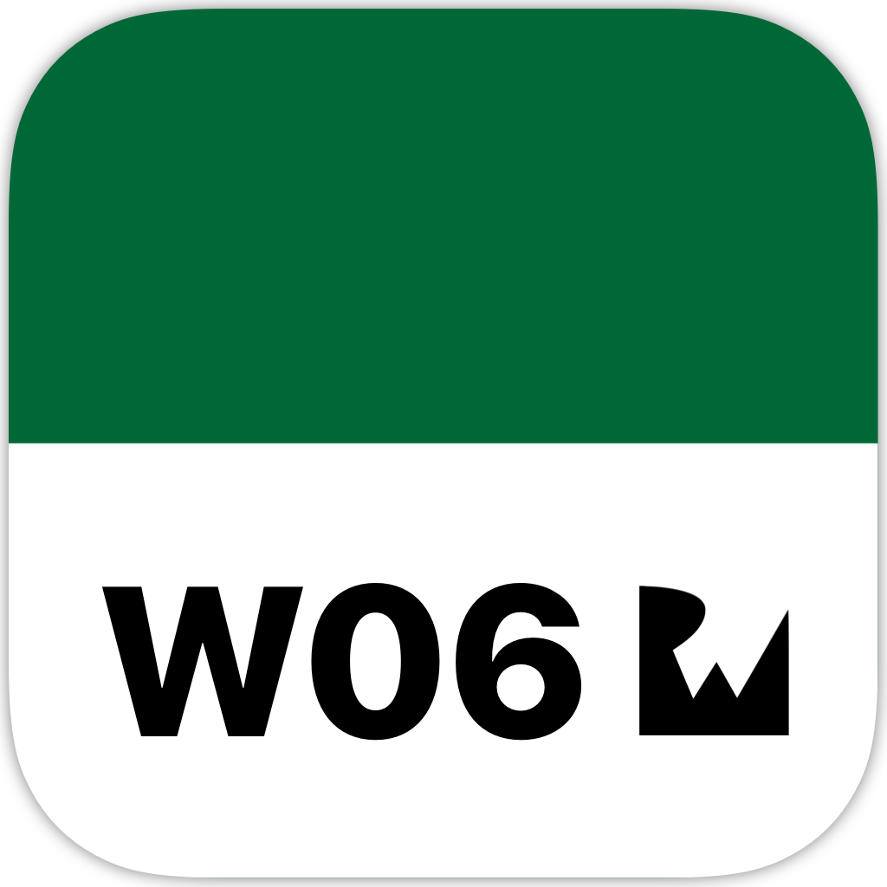

<!-- Header -->

<h1>Week 06. Collection views</h1>

<!-- Body -->
## Frameworks
- Foundation
- UIKit

## Description

## Preview
Those are the most relevant screenshots on the app.

	
	
	
	

<!-- Footer -->