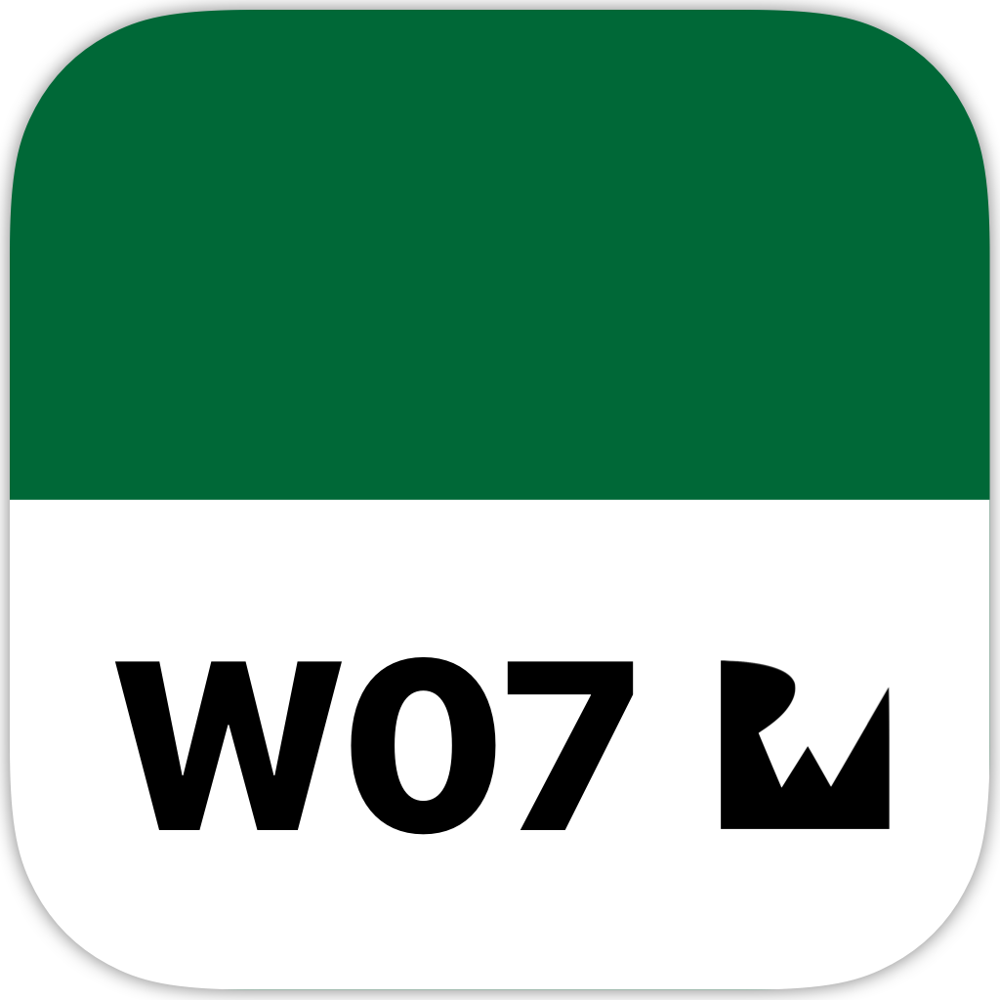
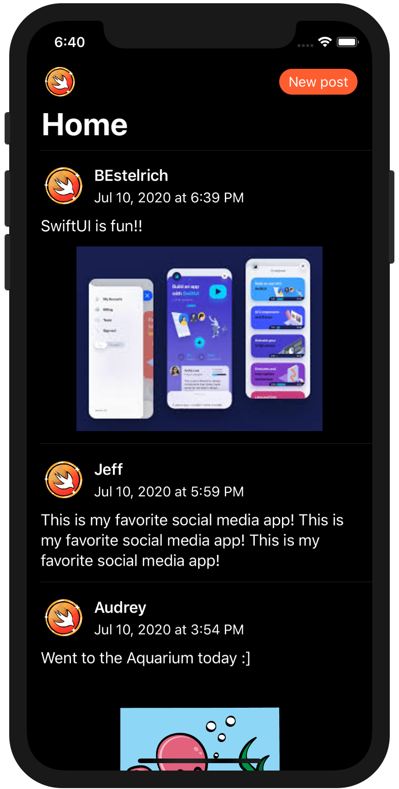
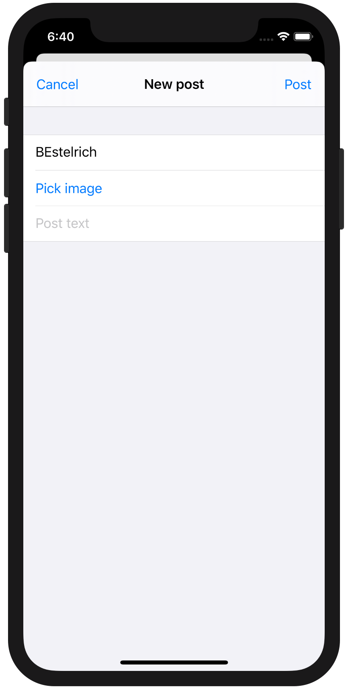
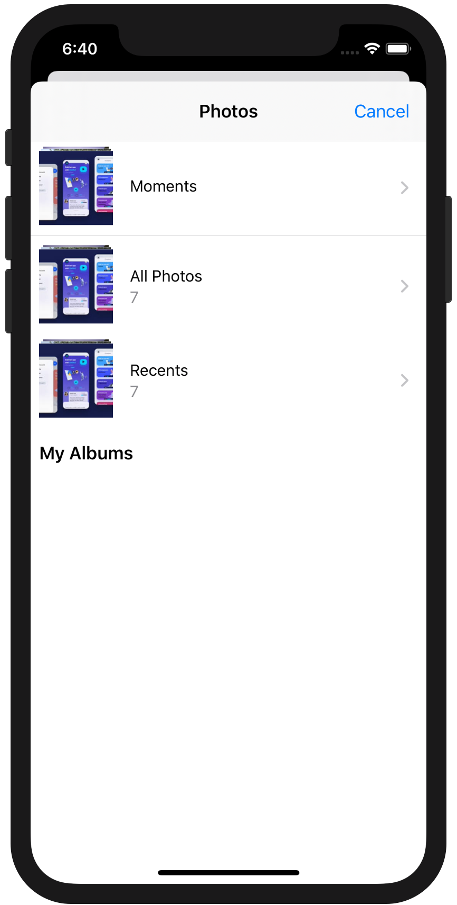

<!-- Header -->

<h1>Week 07. SwiftUI</h1>

<!-- Body -->
## Frameworks
- SwiftUI

## Description
This project has been conceived as a **team** assignment and completed exclusively in **SwiftUI**. The main goal is to build a simple list that **displays some predefined posts** and allows the user to **make a new post with and without attached image**.

Data has been passed through the different views by conforming the model to the `ObservableObject` protocol and defining the model instance in the view as `ObservedObject`. **MVVM was the chosen pattern** to build the app. Finally the **Image picker** implementation has taken place by creating a `Coordinator` class that conformed to `UIImagePickerControllerDelegate` and passed the selected image from its delegate.

## Preview
Those are the most relevant screenshots on the app.

	
	
	

<!-- Footer -->