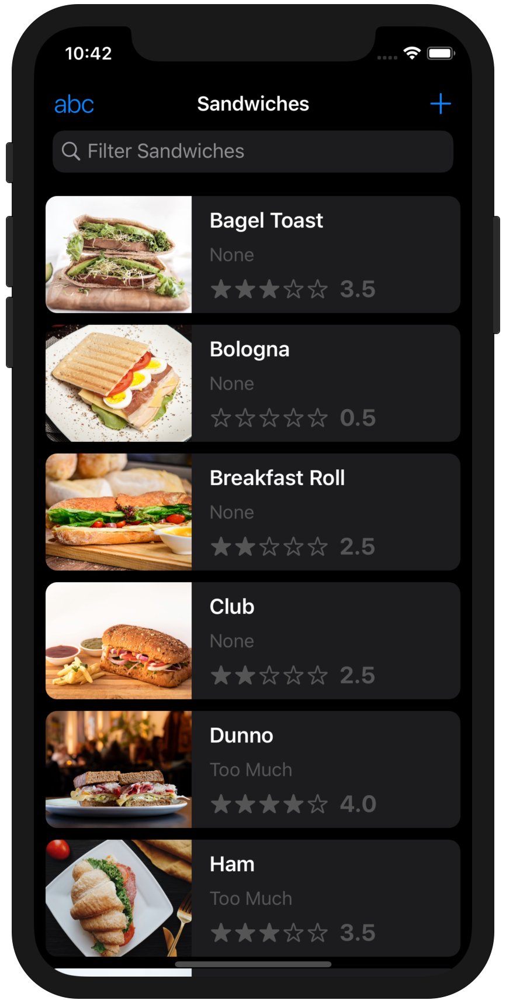
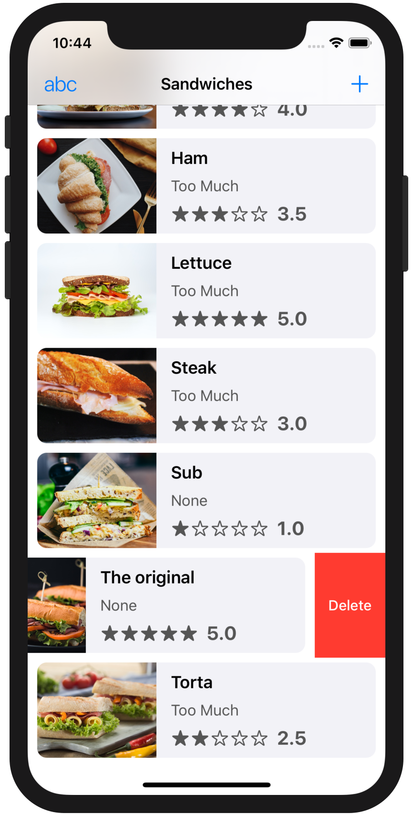
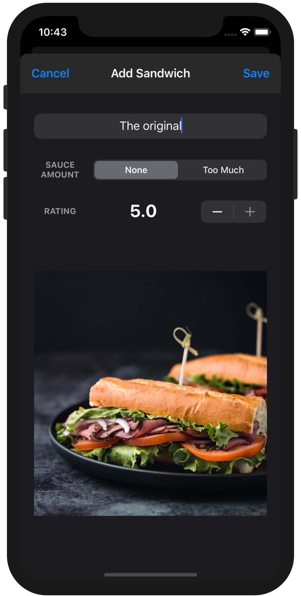
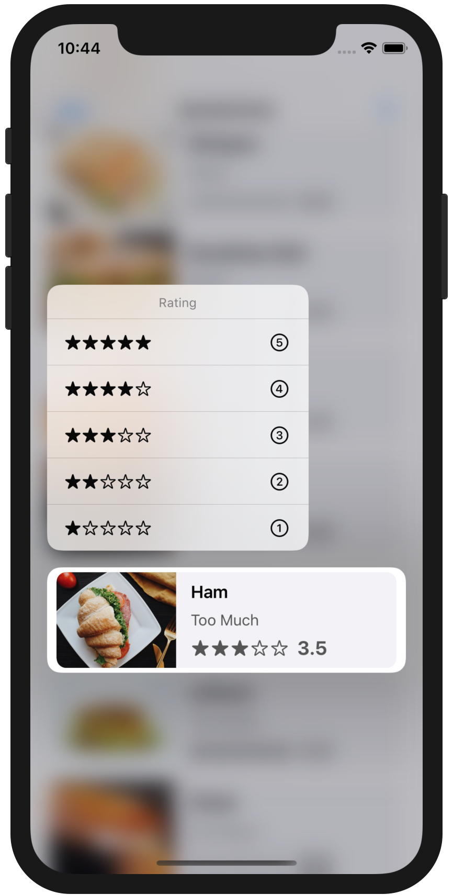
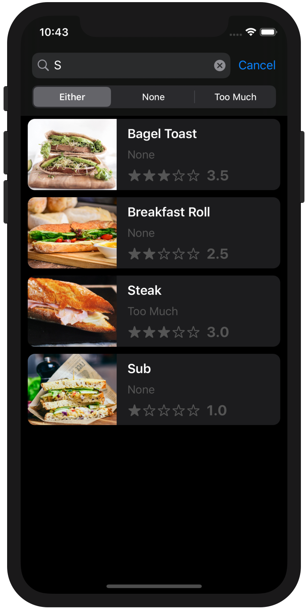

<!-- Header -->

<h1>Week 08. Saving data</h1>

<!-- Body -->
## Frameworks/External dependencies
- Foundation
- UIKit
- CoreData

## Description
This assignment has been about **adding persistence** to an existent app. Initially the app presented a hard coded array of sandwiches and, in case a new element was added, there was no data persistence between relaunches.

First of all, the filter sauce amount selection has been handled by using **UserDefaults to save user's last selection**. On the other hand, the original array has been replaced for a **JSON file** whose elements' are automatically **saved to CoreData on the first launch** when there is still no data. Using a **property list object** could have been an alternative to the JSON file. Moreover any new sandwich can now be stored in CoreData keeping the same original functionality. Deleting an element by a left swipe removes the selected sandwich from the table-view array and CoreData as well.

The table-view can be **sorted by name, sauce amount or rating** and the selection being toggled from a menu bar button. Sandwich sorting persists accordingly between relaunches and even when any filter is applied.

Finally, **rating** is an additional feature that allows any sandwich to be rated on creation and to be updated by a **contextual menu**, presented after a long tap on the respective cell.

## Preview
Those are the most relevant screenshots of the app.

	
	
	
	
	

<!-- Footer -->