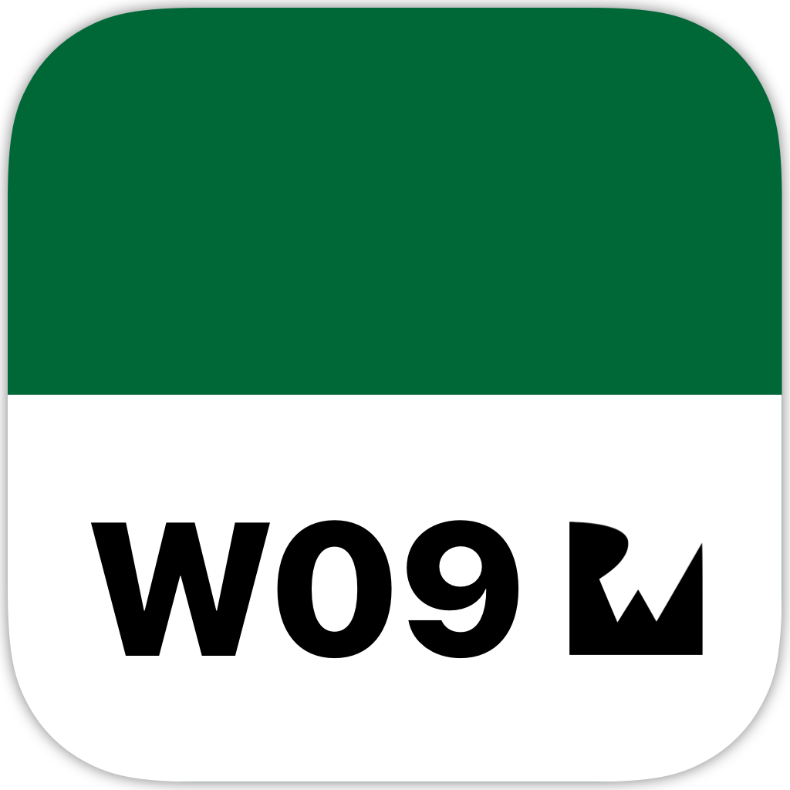
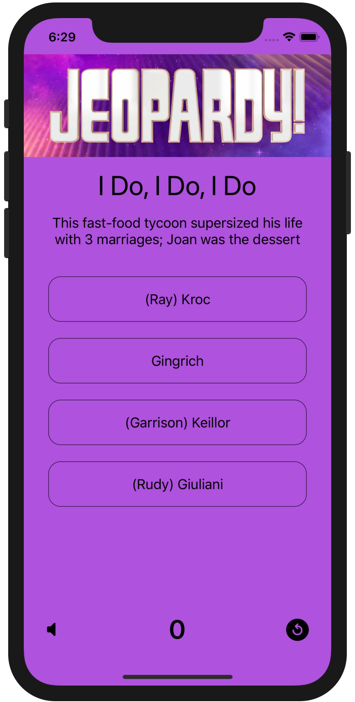
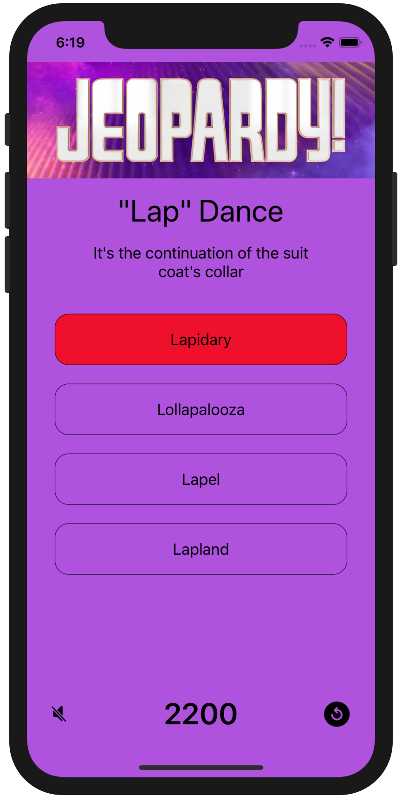
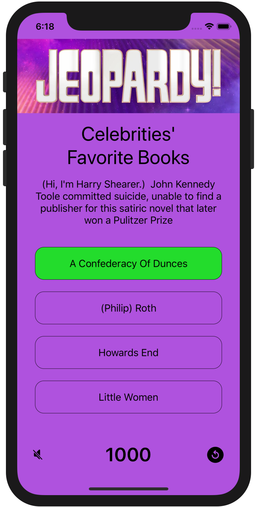

<!-- Header -->

<h1>Week 09. Networking and design patters</h1>

<!-- Body -->
## Frameworks/External dependencies
- Foundation
- UIKit
- AVFoundation

## Description
JQuiz is an app that **fetches data from the [JService.io API](http://www.jservice.io)** which stores more that 150.000 trivia questions, and **presents to the user a question with four possible options** to choose from. In order to provide multiple solutions, when there is only one attached to each question, **a completion handler is used to concatenate different URLSessions**. Moreover the header image has to be downloaded and stored locally on the app first launch to avoid subsequent download requests.

On the other hand when an answer is selected in the game, the current **table-view cell highlights in green/red** for a few seconds, the score label is updated and a new question is presented automatically. At the right bottom corner there is a reset button presenting the possibility to restart the game at any moment.

Finally, the app allows to **play/pause background music** during the game and the actual user selection setting is persisted between relaunches.

## Preview
Those are the most relevant screenshots of the app.

	
	
	

<!-- Footer -->