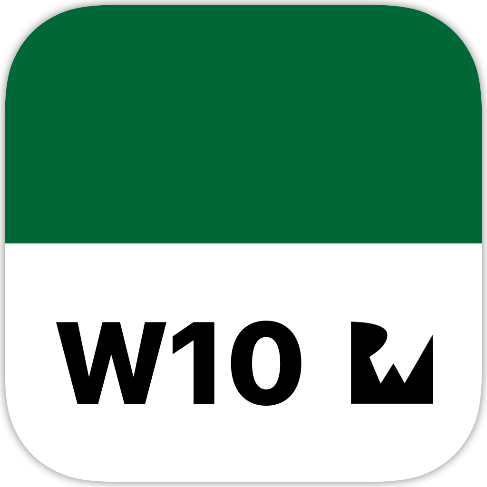

<!-- Header -->

<h1>Week 10. Concurrency and memory management</h1>

<!-- Body -->
## Frameworks/External dependencies
- Foundation
- PlaygroundSupport

## Description
The **goal** of this short playground exercise is about extending UIView to accept a `DispatchGroup` argument and **show a message when the animation completes**. 

In order to complete the exercise we have created an **extension of UIView with a static method called animate** that adds a parameter called group that now accepts a `DispatchGroup` object. After **defining the enter/leave methods on the completion handler** we add the actual DispatchGroup to each animation call and we'll get a notification after the last animation has finished.

<!-- Footer -->