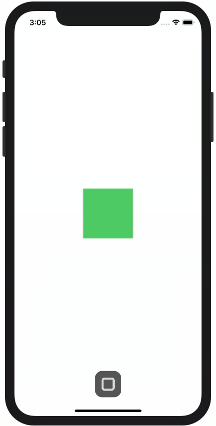

<!-- Header -->

<h1>Week 11. Animation, Xcode tips and tricks</h1>

<!-- Body -->
## Frameworks/External dependencies
- Foundation
- UIKit

## Description
AnimationFactory is a demo app that **showcases the usage of UIKit object animations**. Consists of a **main button and three choice buttons** that pan out when the animations begins. Every time a choice button is tapped, the respective animation enters in the queue and a **notification is shown to let the user now that it has been added to the queue**. The final animation starts when the play button is tapped and reverses itself to the original state at the end of it.

In order to add multiple and independent animations to the same object we have used a reference to `UIViewPropertyAnimator` for each object that had to be animated. Then each animation has been added on each choice button tap or even canceled when a new notification need to be presented before the current one had finished. All those methods have been **extracted from the main view-controller to an AnimationsHelper object to avoid Massive View Controllers**.

## Preview
This is a quick demo of animations contained in the app.

	

<!-- Footer -->