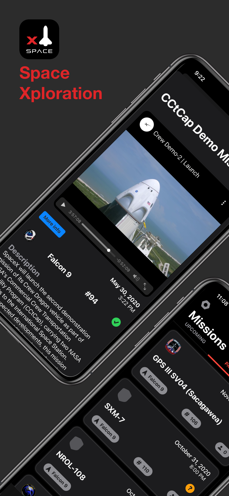
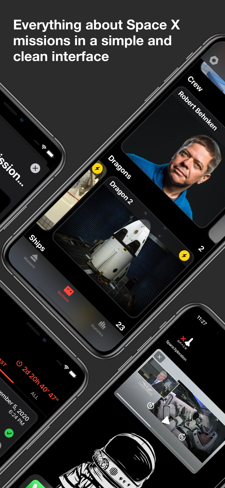
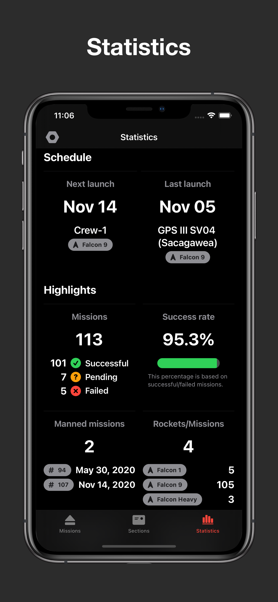
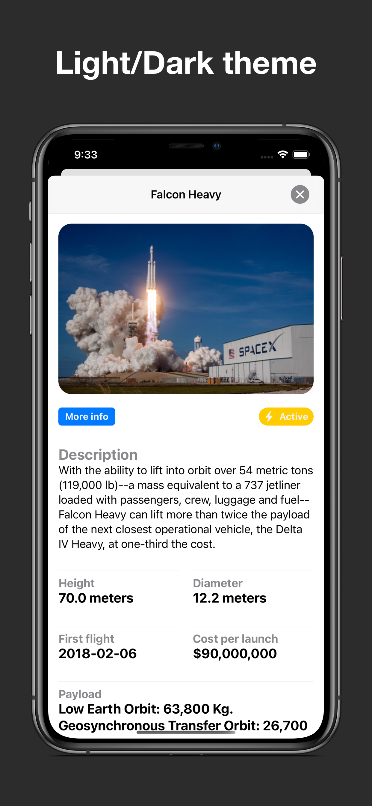
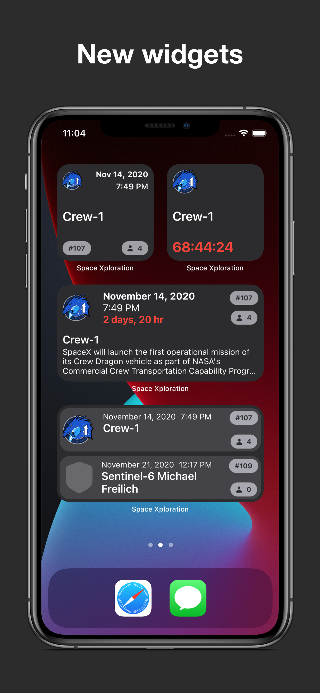

<!-- Header -->

<h1>Week 12. Capstone project: Space Xploration</h1>

<!-- Body -->
## Frameworks/External dependencies
- Foundation
- SwiftUI
- MapKit
- WebKit
- UserNotifications
- Kingfisher

## Description
The Capstone project is our last journey into the bootcamp. Everyone is expected to build a **fully functional app in a single week** showing what we learnt.

Space Xploration **is based on the Space X company and provides information about theirs missions and company sections, notifying users when then next mission is due and showing a video of the entire mission.** It’s completely written in Swift and SwiftUI being MVVM the chosen design pattern. The app uses multiple Apple frameworks in addition to Kingfisher that takes care of the image fetching process.

The app is divided in **two parts: missions and sections.** On the first tab you can find a list of upcoming missions and 2 time references. The red view is a countdown of the next mission and the gray one is a reference since the last completed mission. At the same time those missions can be filtered by upcoming or completed, being upcoming the default. Each mission has a **reminder button and shows the date, name, rocket, flight number and the success of the mission** on the compact view. 

Tapping on the circle next to the title presents some **additional information including a video feed for completed launches.** The icon that appears on the left side of the title is the official mission patch that the astronauts were on their suits.

In the **Sections tab the information is shown by a horizontal tab-view for each section.** Once you tap on a rocket for example a detail view is presented with all the information regarding this rocket. And in some sections as Crew for instance, the user finds a field called "More information" that presents additional details from wikipedia in an external browser.

Finally we have mission launchpads and landpads with their respective details and showing a map of their location. Those **maps have been generated by using UIViewRepresentable in order to import MapKit into SwiftUI.**

## Preview
Those are the most relevant screenshots of the app.

	<a href="https://apps.apple.com/app/space-xploration/id1530580909">
	

	
	
	
	
    

<!-- Footer -->